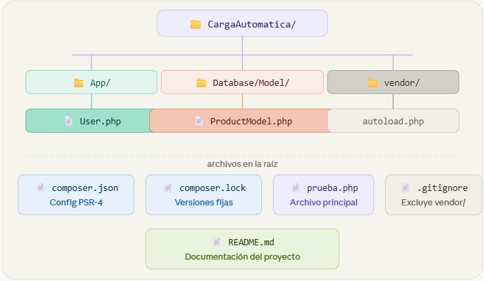
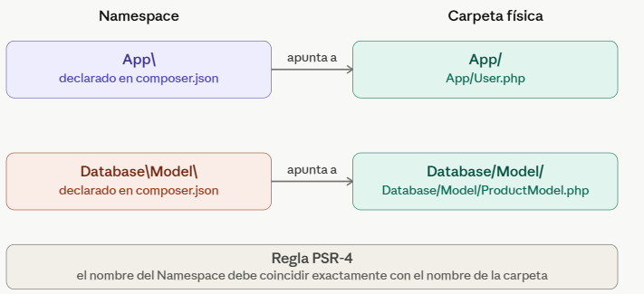
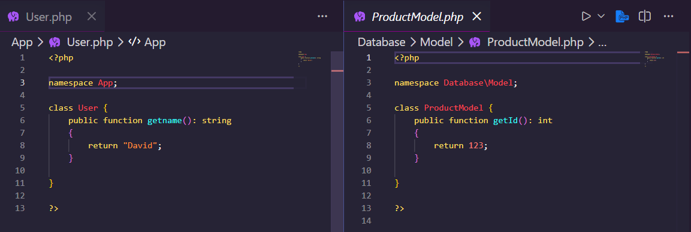
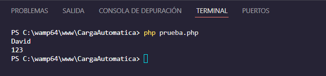

# Universidad Tecnológica de Panamá

# Facultad de Ingeniería de Sistemas Computacionales

# Implementación de Carga Automática (Autoload) bajo el Estándar PSR-4 con Composer

## Fecha de Ejecución:
3 Mayo, 2026

## Objetivos

- Comprender y aplicar el estándar PSR-4 para la organización de archivos y clases.
- Configurar el archivo composer.json para establecer un mapa de Carga Automática.
- Utilizar el comando dump-autoload para eliminar el uso de include y require manuales en el proyecto.

## Introducción

PSR-4 es un estándar de PHP que define cómo deben organizarse los archivos y clases usando Namespaces. Composer es la herramienta que implementa este estándar generando un autoloader que carga las clases automáticamente sin necesidad de escribir require o include manualmente.

En este laboratorio se configuró el autoloader de Composer bajo PSR-4, organizando las clases en carpetas que corresponden a sus Namespaces, eliminando por completo los include manuales del proyecto.

## ⚙️ Requisitos Previos

### Tecnologías utilizadas

- 🐘 PHP 8.0 o superior
- 📦 Composer (última versión estable)
- 💻 Entorno de desarrollo local: WampServer
- 📝 Editor de código: Visual Studio Code

### 🖥️ Sistema Operativo

- Windows 10 / 11

## 🔧 Instalación y configuración del proyecto

### 1. Clonar el repositorio

```bash
git clone https://github.com/Carlos29-ux/Carga_Automatica.git
```
Descarga el proyecto de GitHub a tu computadora.

---

### 2. Entrar a la carpeta

```bash
cd Carga_Automatica
```
Entra a la carpeta del proyecto para ejecutar los siguientes comandos dentro de ella.

---

### 3. Abrir en Visual Studio Code

```bash
code .
```
Abre el proyecto directamente en VS Code desde la terminal.

---

### 4. Verificar Composer

```bash
composer --version
```
Confirma que Composer está instalado. Si no lo tienes, descárgalo en https://getcomposer.org

---

### 5. Verificar PHP

```bash
php --version
```
Confirma que tienes PHP 8.0 o superior instalado.

---

### 6. Generar el autoloader

```bash
composer install
```
Lee el `composer.json` y genera la carpeta `vendor/` con el autoloader PSR-4.

---

### 7. Actualizar el autoloader si agregas nuevas clases

```bash
composer dump-autoload
```
Regenera el mapa de clases para que Composer reconozca archivos nuevos.

---

### 8. Ejecutar el proyecto

```bash
php prueba.php
```
Ejecuta el archivo principal y muestra los resultados en pantalla.

## 📁 Estructura de Archivos

### 1. Estructura del Proyecto



### Descripción de archivos

**📁 App/**
Carpeta que contiene las clases del namespace `App\`. Agrupa todo lo relacionado con la lógica de usuarios.

**📄 App/User.php**
Clase `User` con namespace `App`. Contiene el método `getname()` que retorna el nombre del usuario.

**📁 Database/Model/**
Carpeta que contiene las clases del namespace `Database\Model\`. Agrupa los modelos de base de datos.

**📄 Database/Model/ProductModel.php**
Clase `ProductModel` con namespace `Database\Model`. Contiene el método `getId()` que retorna el ID del producto.

**📁 vendor/**
Generada automáticamente por Composer al correr `composer install`. Contiene el autoloader PSR-4. No se sube a GitHub gracias al `.gitignore`.

**📄 composer.json**
Archivo de configuración de Composer. Define el mapa PSR-4 que relaciona cada Namespace con su carpeta física.

**📄 composer.lock**
Registra las versiones exactas de las dependencias instaladas. Se genera automáticamente junto con `vendor/`.

**📄 prueba.php**
Archivo principal del proyecto. Carga el autoloader, importa las clases con `use` e instancia los objetos para demostrar que el sistema funciona correctamente.

**📄 .gitignore**
Le indica a Git que ignore la carpeta `vendor/` al subir el proyecto a GitHub.

**📄 README.md**
Documentación oficial del proyecto. Incluye guía de instalación, estructura de archivos y conclusiones técnicas.

--------

### 2. Relación de Namespaces y las Carpetas Físicas



Muestra cómo cada Namespace definido en composer.json apunta exactamente a una carpeta física del proyecto según el estándar PSR-4.

## 🧪 Pruebas de ejecución

### Implementación del estándar PSR-4 en las clases



> Se puede observar que `User.php` declara `namespace App;` y `ProductModel.php` 
> declara `namespace Database\Model;`. Esto es la base del estándar PSR-4 — 
> cada clase declara el Namespace que corresponde exactamente a su carpeta física, 
> permitiendo que Composer las encuentre automáticamente sin necesidad de `require`.

### Codigo de Ejecución - Archivo: prueba.php

```php
<?php

use App\User;
use Database\Model\ProductModel;    

require "vendor/autoload.php";

$user = new User();
echo $user->getname();
echo "\n";

$product = new ProductModel();
echo $product->getId();

?>
```
### Captura y Resultado de Ejecución



## 👤 Información del Estudiante

Nombre: Carlos Concepción

Correo: carlos.concepcion2@utp.ac.pa

Curso: Desarrollo de Software VII

Instructor: Irina Fong


